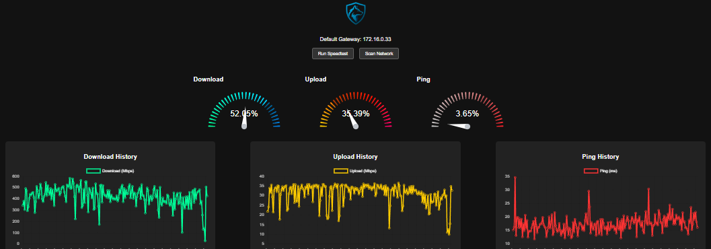

# 🛡️ NetWatchdog

NetWatchdog is a modern network monitoring dashboard that:
- 🧭 Displays gateway info
- 🚀 Runs and logs speed tests every 2 minutes
- 📊 Visualizes history (Download, Upload, Ping)
- 🔎 Scans your local network for active hosts and open ports
- 💡 Mobile responsive with animated gauges and custom logo branding

---

## 📸 Screenshot


---

## 📦 Features
| Feature | Description |
|--------|-------------|
| 🔁 Auto Speedtest | Every 2 minutes with low-speed alert logging |
| 📈 Historical Charts | Shows separate line charts per metric |
| 🖥️ Gauge UI | Animated gauges for Download/Upload/Ping |
| 🔍 Network Scanner | Displays hosts and their open ports |
| 🧩 API | Powered by FastAPI |
| 🖼️ Branding | Custom logo and favicon support |

---

## 🚀 Quick Start

### 1. Install dependencies
```bash
pip install -r requirements.txt
cd frontend
npm install
```

### 2. Run Development Servers
```bash
# In terminal 1
uvicorn backend.main:app --reload --port 8181

# In terminal 2
cd frontend
npm start
```

### 3. Build Frontend for Production
```bash
npm run build
```

### 4. Run Full App in One Server
```bash
uvicorn backend.main:app --port 8181
```

---

## 🪟 Windows Service Setup

Use [NSSM](https://nssm.cc/) to install as a service:
```bash
nssm install NetWatchdogService "python" "C:\path\to\main.py"
```

---

## 📂 Project Structure

```
NetWatchdog/
├── backend/
│   ├── main.py
│   ├── routes.py
│   ├── scanner.py
│   ├── speedtest_runner.py
│   └── speedtest_history.json
├── frontend/
│   ├── build/
│   ├── src/
│   │   ├── App.js
│   │   ├── App.css
│   │   └── assets/logo.svg
│   └── public/index.html
├── .gitignore
└── README.md
```

---

## 🛠️ Technologies Used

- React + Chart.js + react-gauge-chart
- FastAPI + subprocess for CLI speedtest
- Node + Vite for frontend
- Python 3.11+

---

## 🐞 Known Issues

- Some speedtest servers can hang, fallback handling is basic.
- Port scanning performance varies per network size.

---

## 👨‍💻 Author

Developed by Kenneth Schaefer (@parzidog)
